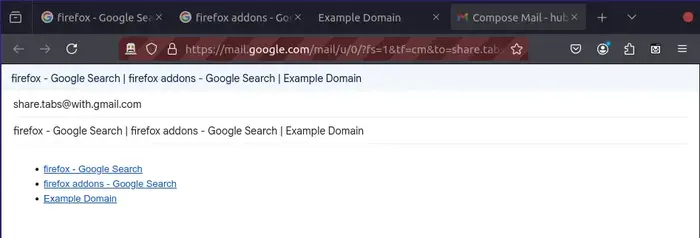

# Share Tabs with Gmail

**Share Tabs with Gmail** is a Firefox addon that collects the titles and URLs of tabs and shares them via Gmail.



## Features

- Collects tab information (titles and URLs) and composes an email in Gmail, opened in a new tab, with:
  - **Recipient Email**: Left empty unless optionally set via the addon’s settings page.
  - **Subject**: Automatically generated based on the titles of the collected tabs.
  - **Body**: A formatted HTML list of links using the collected titles and URLs.
- Click the extension icon to share all tabs in the current window. (Default key binding: <kbd>Alt+Shift+J</kbd>)
- If specific tabs are selected, only those will be shared. To select multiple tabs with the mouse, hold down <kbd>Ctrl</kbd> and click the tabs.
- Click the icon while holding <kbd>Shift</kbd> to only share the currently active tab. (default key binding: <kbd>Alt+Shift+K</kbd>)

Remark about permissions:
The extension only interacts with Gmail’s compose window to automate the email creation process. It does not access any other data from your Gmail account or emails.

## Usage

- **Share All Tabs**: Click the addon icon or press <kbd>Alt+Shift+J</kbd> to share all open tabs in the current window via Gmail.
- **Send Selected Tabs**: If tab selection is active, only the selected tabs will be shared.
- **Send Current Tab**: Hold <kbd>Shift</kbd> and click the icon or press <kbd>Alt+Shift+K</kbd> to share only the active tab.
- **Set a Default Recipient**: Use the settings page to specify a default email recipient. If not set, the Gmail draft will have an empty "To" field.
- **Subject Line Separator**: When sharing multiple tabs, the titles of up to four tabs are included in the subject line, separated by a customizable separator. By default, the separator is ` | `, but you can change it in the addon’s settings. If there are more than four tabs, only the first four titles are shown, and they may be truncated.
- **Change Key Bindings**: Right-click the addon icon, select **Manage Extension**, click the gear icon, and then choose **Manage Extension Shortcuts**.
- **Note on Gmail Drafts**: Gmail automatically saves drafts for all composed emails. If you do not send the email, a draft will remain in your Gmail Drafts folder.

### Options

The following options are available:

- **Email**: Predefine a recipient email address for shared tab emails. If you want to manually add a recipient each time, leave this field empty.
- **Separator**: Customize the way links are separated in the email body. If left empty the default `|` is used.

## Installation

Visit <https://addons.mozilla.org/en-US/firefox/addon/share-tabs-with-gmail>, click 'Add to Firefox' and follow the prompts to install.

## Permissions

This extension requires the following permissions:

- tabs: This is used to collect the titles and URLs of open tabs to include them in the email. 
- storage: To locally store the options (default email address and custom separator).
- activeTab: This permission is required because the extension injects a content script into Gmail's compose window to automate the insertion of tab information. The extension does not read or access other data from Gmail (e.g., your inbox or account details). It only interacts with the compose window and adds the generated email content.

## Development

### Prerequisites

- Node.js
- npm

### Setup

1. Clone the repository.
2. Navigate to the project directory.
3. Run `npm install` to install dependencies.

### Scripts

- `npm run build`: Build the addon using `web-ext`.
- `npm run clean`: Clean the build artifacts.
- `npm run start`: Run the addon in Firefox using `web-ext`.
- `npm run lint`: Lint the addon using `web-ext`.

### Project Structure

```
├── src
│   ├── background.js       # Handles tab collection and Gmail integration
│   ├── contentScript.js    # Injects HTML content into Gmail's compose window
│   │   ├── options.html    # Options page structure
│   │   ├── options.js      # Logic for saving and managing options
│   │   └── options.css     # Styling for the options page
│   └── manifest.json       # Firefox add-on configuration
├── assets
│   ├── images
│   │   ├── example.webp    # Example image for README
│   │   └── options-page.webp # Preferences page image for README
├── package.json            # npm configuration for build and scripts
└── README.md               # Documentation for the project
```

## License

This project is licensed under the [GNU General Public License Version 3](LICENSE).

